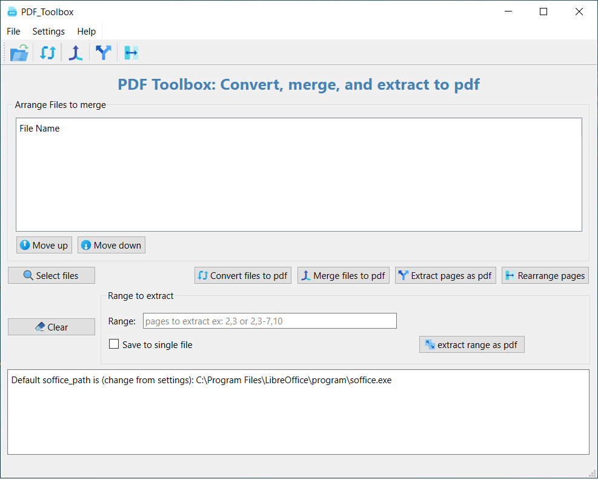

# 📄 PDF Toolbox 🛠️

**PDF Toolbox** is a powerful, desktop application designed to handle a variety of PDF tasks with ease. Built for users who frequently work with PDF files, this tool provides an intuitive interface to perform complex PDF operations without any hassle, and without the need to share your private documents with online websites which could pose a security risk.

## ✨ Features

✅ **Convert to PDF**  
Easily select multiple files and convert them into PDF format.

✅ **Merge & Rearrange Pages**  
Merge pages from different files, rearrange them as needed, and save the new combined file as PDF.

✅ **Extract Pages**  
- Extract single pages or a range of pages.
- Save extracted pages either as separate files or as one combined PDF.

✅ **Split multiple files**  
- Split multiple files simultaneously into single pages.
- Save the extracted single pages into folders corresponding to each file.

✅ **User-Friendly Interface**  
Simple, clean, and efficient UI for easy navigation and quick actions.

---

## 🚀 Usage Scenarios
- Merge reports or chapters into a single PDF.
- Extract specific pages from large PDFs for focused work.
- Rearrange pages from different documents to create custom PDFs.
- Convert multiple document types to PDF effortlessly.

---

## 📽️ Video Tutorial
👉 Click the image below to watch the tutorial on YouTube

## 💻 Installation & Usage

Download the app installer from the release section
